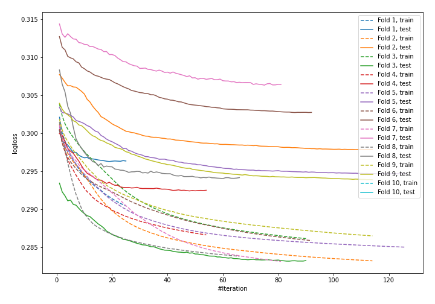

# Summary of 10_Default_NeuralNetwork

## Neural Network
- **dense_layers**: 2
- **dense_1_size**: 32
- **dense_2_size**: 16
- **dropout**: 0
- **learning_rate**: 0.05
- **momentum**: 0.9
- **decay**: 0.001
- **explain_level**: 0
- **model_architecture_json**: "{\"class_name\": \"Sequential\", \"config\": {\"name\": \"sequential_10\", \"layers\": [{\"class_name\": \"Dense\", \"config\": {\"name\": \"dense_28\", \"trainable\": true, \"batch_input_shape\": [null, 28], \"dtype\": \"float32\", \"units\": 32, \"activation\": \"relu\", \"use_bias\": true, \"kernel_initializer\": {\"class_name\": \"VarianceScaling\", \"config\": {\"scale\": 1.0, \"mode\": \"fan_avg\", \"distribution\": \"uniform\", \"seed\": null}}, \"bias_initializer\": {\"class_name\": \"Zeros\", \"config\": {}}, \"kernel_regularizer\": null, \"bias_regularizer\": null, \"activity_regularizer\": null, \"kernel_constraint\": null, \"bias_constraint\": null}}, {\"class_name\": \"Dense\", \"config\": {\"name\": \"dense_29\", \"trainable\": true, \"batch_input_shape\": [null, 28], \"dtype\": \"float32\", \"units\": 16, \"activation\": \"relu\", \"use_bias\": true, \"kernel_initializer\": {\"class_name\": \"VarianceScaling\", \"config\": {\"scale\": 1.0, \"mode\": \"fan_avg\", \"distribution\": \"uniform\", \"seed\": null}}, \"bias_initializer\": {\"class_name\": \"Zeros\", \"config\": {}}, \"kernel_regularizer\": null, \"bias_regularizer\": null, \"activity_regularizer\": null, \"kernel_constraint\": null, \"bias_constraint\": null}}, {\"class_name\": \"Dense\", \"config\": {\"name\": \"dense_30\", \"trainable\": true, \"dtype\": \"float32\", \"units\": 1, \"activation\": \"sigmoid\", \"use_bias\": true, \"kernel_initializer\": {\"class_name\": \"VarianceScaling\", \"config\": {\"scale\": 1.0, \"mode\": \"fan_avg\", \"distribution\": \"uniform\", \"seed\": null}}, \"bias_initializer\": {\"class_name\": \"Zeros\", \"config\": {}}, \"kernel_regularizer\": null, \"bias_regularizer\": null, \"activity_regularizer\": null, \"kernel_constraint\": null, \"bias_constraint\": null}}]}, \"keras_version\": \"2.3.1\", \"backend\": \"tensorflow\"}"

## Validation
 - **validation_type**: kfold
 - **k_folds**: 10
 - **shuffle**: True
 - **stratify**: True

## Optimized metric
logloss

## Training time

3246.5 seconds

## Metric details
|           |    score |     threshold |
|:----------|---------:|--------------:|
| logloss   | 0.295776 | nan           |
| auc       | 0.862712 | nan           |
| f1        | 0.590847 |   0.282167    |
| accuracy  | 0.884728 |   0.502231    |
| precision | 0.79093  |   0.671252    |
| recall    | 1        |   9.14282e-05 |
| mcc       | 0.514844 |   0.338345    |

## Confusion matrix (at threshold=0.282167)
|                     |   Predicted as negative |   Predicted as positive |
|:--------------------|------------------------:|------------------------:|
| Labeled as negative |                   56434 |                    5649 |
| Labeled as positive |                    4284 |                    7172 |

## Learning curves
