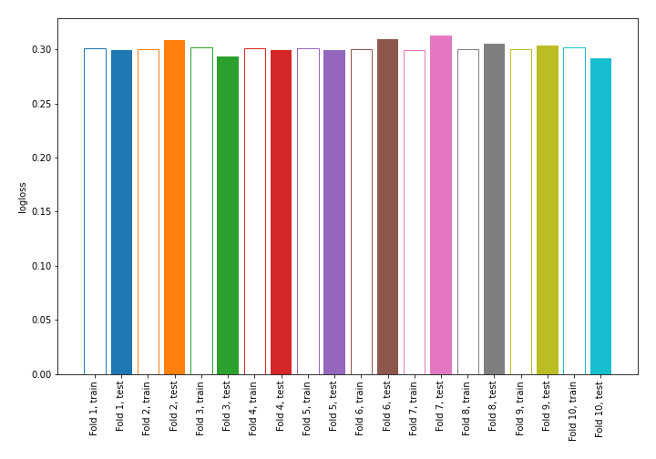

# Summary of 1_DecisionTree

## Decision Tree
- **criterion**: entropy
- **max_depth**: 4
- **explain_level**: 0

## Validation
 - **validation_type**: kfold
 - **k_folds**: 10
 - **shuffle**: True
 - **stratify**: True

## Optimized metric
logloss

## Training time

4.3 seconds

## Metric details
|           |    score |   threshold |
|:----------|---------:|------------:|
| logloss   | 0.302228 |  nan        |
| auc       | 0.848344 |  nan        |
| f1        | 0.586172 |    0.31741  |
| accuracy  | 0.881532 |    0.452043 |
| precision | 0.777557 |    0.654455 |
| recall    | 1        |    0.025144 |
| mcc       | 0.511762 |    0.31741  |

## Confusion matrix (at threshold=0.31741)
|                     |   Predicted as negative |   Predicted as positive |
|:--------------------|------------------------:|------------------------:|
| Labeled as negative |                   57661 |                    4422 |
| Labeled as positive |                    4873 |                    6583 |

## Learning curves
