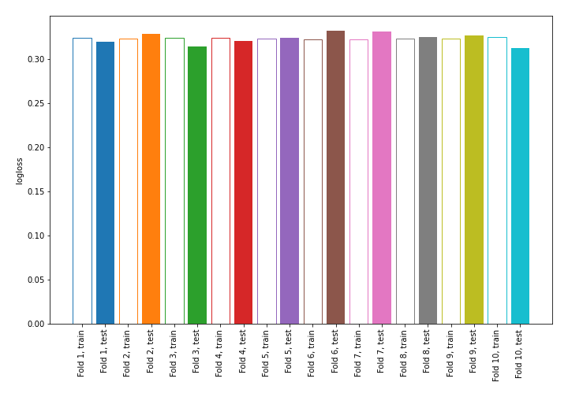

# Summary of 2_DecisionTree

## Decision Tree
- **criterion**: entropy
- **max_depth**: 2
- **explain_level**: 0

## Validation
 - **validation_type**: kfold
 - **k_folds**: 10
 - **shuffle**: True
 - **stratify**: True

## Optimized metric
logloss

## Training time

3.4 seconds

## Metric details
|           |    score |   threshold |
|:----------|---------:|------------:|
| logloss   | 0.323789 |  nan        |
| auc       | 0.807095 |  nan        |
| f1        | 0.556035 |    0.206129 |
| accuracy  | 0.875236 |    0.375737 |
| precision | 0.6979   |    0.375737 |
| recall    | 1        |    0.044558 |
| mcc       | 0.467081 |    0.206129 |

## Confusion matrix (at threshold=0.206129)
|                     |   Predicted as negative |   Predicted as positive |
|:--------------------|------------------------:|------------------------:|
| Labeled as negative |                   54618 |                    7465 |
| Labeled as positive |                    4170 |                    7286 |

## Learning curves
