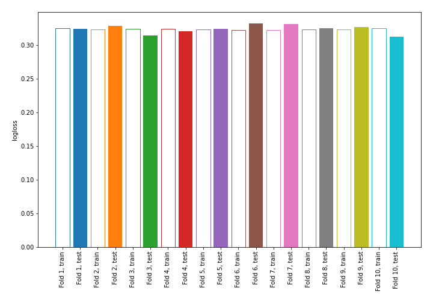

# Summary of 3_DecisionTree

## Decision Tree
- **criterion**: gini
- **max_depth**: 2
- **explain_level**: 0

## Validation
 - **validation_type**: kfold
 - **k_folds**: 10
 - **shuffle**: True
 - **stratify**: True

## Optimized metric
logloss

## Training time

3.3 seconds

## Metric details
|           |    score |   threshold |
|:----------|---------:|------------:|
| logloss   | 0.32425  |  nan        |
| auc       | 0.807437 |  nan        |
| f1        | 0.553797 |    0.259835 |
| accuracy  | 0.875046 |    0.528564 |
| precision | 0.698477 |    0.528564 |
| recall    | 1        |    0.044558 |
| mcc       | 0.46472  |    0.259835 |

## Confusion matrix (at threshold=0.259835)
|                     |   Predicted as negative |   Predicted as positive |
|:--------------------|------------------------:|------------------------:|
| Labeled as negative |                   54990 |                    7093 |
| Labeled as positive |                    4353 |                    7103 |

## Learning curves
