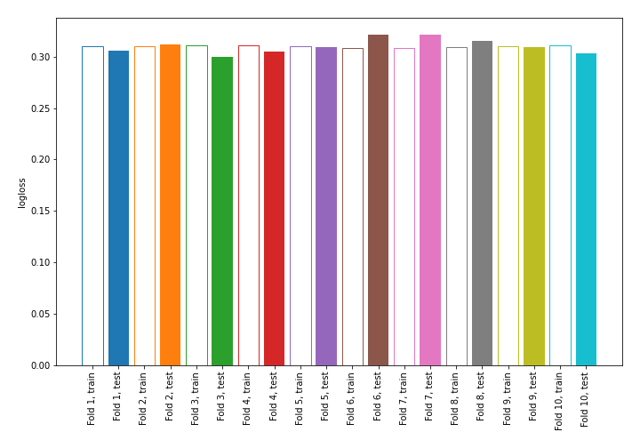

# Summary of 4_Linear

## Logistic Regression (Linear)
- **explain_level**: 0

## Validation
 - **validation_type**: kfold
 - **k_folds**: 10
 - **shuffle**: True
 - **stratify**: True

## Optimized metric
logloss

## Training time

24.4 seconds

## Metric details
|           |    score |   threshold |
|:----------|---------:|------------:|
| logloss   | 0.310281 | nan         |
| auc       | 0.849472 | nan         |
| f1        | 0.576756 |   0.266611  |
| accuracy  | 0.880648 |   0.465556  |
| precision | 0.75698  |   0.586588  |
| recall    | 1        |   0.0109095 |
| mcc       | 0.500338 |   0.266611  |

## Confusion matrix (at threshold=0.266611)
|                     |   Predicted as negative |   Predicted as positive |
|:--------------------|------------------------:|------------------------:|
| Labeled as negative |                   57509 |                    4574 |
| Labeled as positive |                    4960 |                    6496 |

## Learning curves
