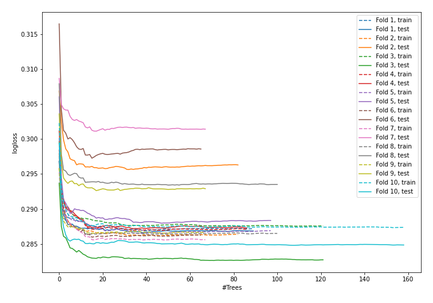

# Summary of 5_Default_RandomForest

## Random Forest
- **criterion**: gini
- **max_features**: 0.6
- **min_samples_split**: 30
- **max_depth**: 6
- **explain_level**: 0

## Validation
 - **validation_type**: kfold
 - **k_folds**: 10
 - **shuffle**: True
 - **stratify**: True

## Optimized metric
logloss

## Training time

43.8 seconds

## Metric details
|           |    score |   threshold |
|:----------|---------:|------------:|
| logloss   | 0.290925 | nan         |
| auc       | 0.869084 | nan         |
| f1        | 0.595304 |   0.286483  |
| accuracy  | 0.885924 |   0.543072  |
| precision | 0.773983 |   0.589621  |
| recall    | 1        |   0.0157659 |
| mcc       | 0.51978  |   0.320796  |

## Confusion matrix (at threshold=0.286483)
|                     |   Predicted as negative |   Predicted as positive |
|:--------------------|------------------------:|------------------------:|
| Labeled as negative |                   56788 |                    5295 |
| Labeled as positive |                    4357 |                    7099 |

## Learning curves
