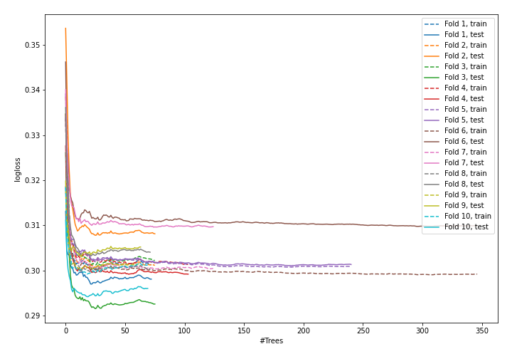

# Summary of 6_Default_ExtraTrees

## Extra Trees Classifier (Extra Trees)
- **criterion**: gini
- **max_features**: 0.6
- **min_samples_split**: 30
- **max_depth**: 6
- **explain_level**: 0

## Validation
 - **validation_type**: kfold
 - **k_folds**: 10
 - **shuffle**: True
 - **stratify**: True

## Optimized metric
logloss

## Training time

43.1 seconds

## Metric details
|           |    score |   threshold |
|:----------|---------:|------------:|
| logloss   | 0.301594 | nan         |
| auc       | 0.858042 | nan         |
| f1        | 0.586275 |   0.286812  |
| accuracy  | 0.883762 |   0.46877   |
| precision | 0.751622 |   0.50946   |
| recall    | 1        |   0.0222609 |
| mcc       | 0.507614 |   0.304266  |

## Confusion matrix (at threshold=0.286812)
|                     |   Predicted as negative |   Predicted as positive |
|:--------------------|------------------------:|------------------------:|
| Labeled as negative |                   56780 |                    5303 |
| Labeled as positive |                    4506 |                    6950 |

## Learning curves
