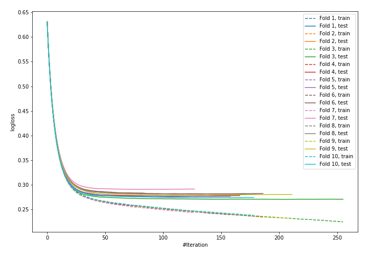

# Summary of 7_Default_Xgboost

## Extreme Gradient Boosting (Xgboost)
- **objective**: binary:logistic
- **eval_metric**: logloss
- **eta**: 0.1
- **max_depth**: 6
- **min_child_weight**: 1
- **subsample**: 1.0
- **colsample_bytree**: 1.0
- **explain_level**: 0

## Validation
 - **validation_type**: kfold
 - **k_folds**: 10
 - **shuffle**: True
 - **stratify**: True

## Optimized metric
logloss

## Training time

28.9 seconds

## Metric details
|           |    score |    threshold |
|:----------|---------:|-------------:|
| logloss   | 0.278708 | nan          |
| auc       | 0.882272 | nan          |
| f1        | 0.611713 |   0.300954   |
| accuracy  | 0.889773 |   0.476768   |
| precision | 0.800245 |   0.648071   |
| recall    | 1        |   0.00118492 |
| mcc       | 0.540457 |   0.339226   |

## Confusion matrix (at threshold=0.300954)
|                     |   Predicted as negative |   Predicted as positive |
|:--------------------|------------------------:|------------------------:|
| Labeled as negative |                   57076 |                    5007 |
| Labeled as positive |                    4202 |                    7254 |

## Learning curves
