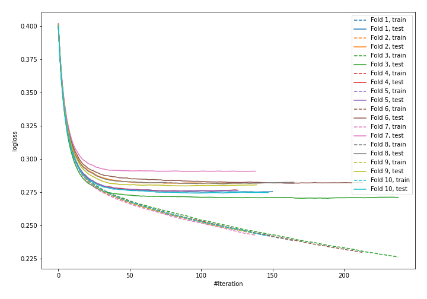

# Summary of 8_Default_LightGBM

## LightGBM
- **objective**: binary
- **metric**: binary_logloss
- **num_leaves**: 31
- **learning_rate**: 0.1
- **feature_fraction**: 0.9
- **bagging_fraction**: 0.9
- **min_data_in_leaf**: 10
- **explain_level**: 0

## Validation
 - **validation_type**: kfold
 - **k_folds**: 10
 - **shuffle**: True
 - **stratify**: True

## Optimized metric
logloss

## Training time

12.7 seconds

## Metric details
|           |    score |     threshold |
|:----------|---------:|--------------:|
| logloss   | 0.278547 | nan           |
| auc       | 0.882316 | nan           |
| f1        | 0.612431 |   0.29628     |
| accuracy  | 0.890086 |   0.513031    |
| precision | 0.797493 |   0.63439     |
| recall    | 1        |   0.000604862 |
| mcc       | 0.538687 |   0.402991    |

## Confusion matrix (at threshold=0.29628)
|                     |   Predicted as negative |   Predicted as positive |
|:--------------------|------------------------:|------------------------:|
| Labeled as negative |                   56952 |                    5131 |
| Labeled as positive |                    4135 |                    7321 |

## Learning curves
