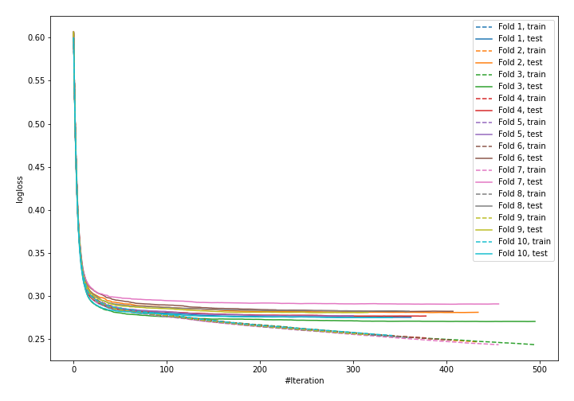

# Summary of 9_Default_CatBoost

## CatBoost
- **learning_rate**: 0.1
- **depth**: 6
- **rsm**: 0.9
- **subsample**: 1.0
- **min_data_in_leaf**: 15
- **explain_level**: 0

## Validation
 - **validation_type**: kfold
 - **k_folds**: 10
 - **shuffle**: True
 - **stratify**: True

## Optimized metric
logloss

## Training time

89.4 seconds

## Metric details
|           |    score |    threshold |
|:----------|---------:|-------------:|
| logloss   | 0.278577 | nan          |
| auc       | 0.881861 | nan          |
| f1        | 0.610696 |   0.307027   |
| accuracy  | 0.890602 |   0.48055    |
| precision | 0.820255 |   0.680922   |
| recall    | 1        |   0.00169028 |
| mcc       | 0.539874 |   0.405712   |

## Confusion matrix (at threshold=0.307027)
|                     |   Predicted as negative |   Predicted as positive |
|:--------------------|------------------------:|------------------------:|
| Labeled as negative |                   57355 |                    4728 |
| Labeled as positive |                    4342 |                    7114 |

## Learning curves
