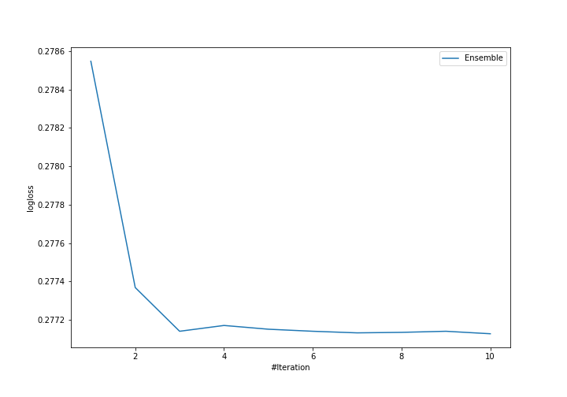

# Summary of Ensemble

## Ensemble structure
| Model              |   Weight |
|:-------------------|---------:|
| 7_Default_Xgboost  |        3 |
| 8_Default_LightGBM |        3 |
| 9_Default_CatBoost |        4 |

## Metric details
|           |    score |    threshold |
|:----------|---------:|-------------:|
| logloss   | 0.277128 | nan          |
| auc       | 0.88369  | nan          |
| f1        | 0.613834 |   0.29578    |
| accuracy  | 0.890752 |   0.510759   |
| precision | 0.812853 |   0.657107   |
| recall    | 1        |   0.00212252 |
| mcc       | 0.5414   |   0.410664   |

## Confusion matrix (at threshold=0.29578)
|                     |   Predicted as negative |   Predicted as positive |
|:--------------------|------------------------:|------------------------:|
| Labeled as negative |                   57036 |                    5047 |
| Labeled as positive |                    4148 |                    7308 |

## Learning curves
