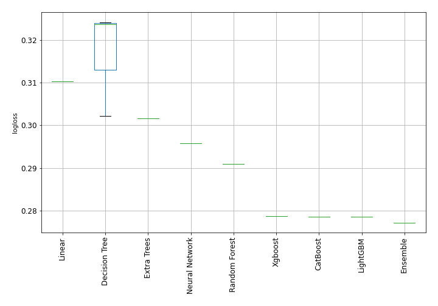

# AutoML Leaderboard

| Best model   | name                     | model_type     | metric_type   |   metric_value |   train_time | Link                                               |
|:-------------|:-------------------------|:---------------|:--------------|---------------:|-------------:|:---------------------------------------------------|
|              | 1_DecisionTree           | Decision Tree  | logloss       |       0.302228 |         4.26 | [Results link](1_DecisionTree/README.md)           |
|              | 2_DecisionTree           | Decision Tree  | logloss       |       0.323789 |         3.38 | [Results link](2_DecisionTree/README.md)           |
|              | 3_DecisionTree           | Decision Tree  | logloss       |       0.32425  |         3.29 | [Results link](3_DecisionTree/README.md)           |
|              | 4_Linear                 | Linear         | logloss       |       0.310281 |        24.35 | [Results link](4_Linear/README.md)                 |
|              | 5_Default_RandomForest   | Random Forest  | logloss       |       0.290925 |        43.78 | [Results link](5_Default_RandomForest/README.md)   |
|              | 6_Default_ExtraTrees     | Extra Trees    | logloss       |       0.301594 |        43.1  | [Results link](6_Default_ExtraTrees/README.md)     |
|              | 7_Default_Xgboost        | Xgboost        | logloss       |       0.278708 |        28.87 | [Results link](7_Default_Xgboost/README.md)        |
|              | 8_Default_LightGBM       | LightGBM       | logloss       |       0.278547 |        12.7  | [Results link](8_Default_LightGBM/README.md)       |
|              | 9_Default_CatBoost       | CatBoost       | logloss       |       0.278577 |        89.42 | [Results link](9_Default_CatBoost/README.md)       |
|              | 10_Default_NeuralNetwork | Neural Network | logloss       |       0.295776 |      3246.51 | [Results link](10_Default_NeuralNetwork/README.md) |
| **the best** | Ensemble                 | Ensemble       | logloss       |       0.277128 |        12.44 | [Results link](Ensemble/README.md)                 |

### AutoML Performance

### AutoML Performance Boxplot
